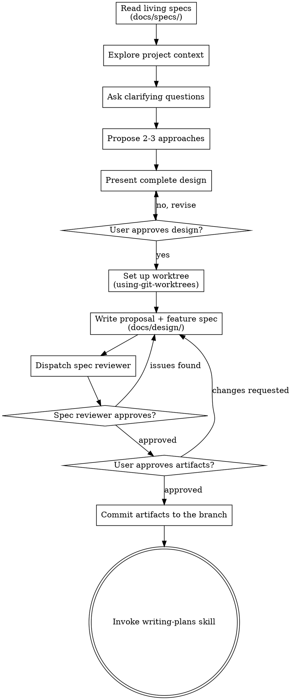

# Brainstorming Ideas Into Designs

Turn ideas into an approved proposal and behavioral feature spec through collaborative dialogue.

**Announce at start:** "I'm using the brainstorming skill to refine this idea into a design."

**HARD GATE:** The proposal and the feature spec must exist, the spec reviewer must approve the feature spec, and the user must approve both artifacts. Until all three are true, do NOT invoke any implementation skill, write any code, or scaffold any project. This applies to every project regardless of perceived simplicity. For truly simple projects the artifacts can be short, but they MUST exist.

## Checklist

Copy this checklist into your working notes. Mark each item as you complete it. Complete the items in order:

- [ ] **Read living specs** — check `docs/specs/` for relevant domain specs. They describe current system behavior. If no spec exists for the domain, the feature spec will define its initial requirements
- [ ] **Explore project context** — files, docs, recent commits
- [ ] **Ask clarifying questions** — purpose, constraints, success criteria
- [ ] **Propose 2-3 approaches** — with trade-offs and your recommendation
- [ ] **Present the complete design** — get user approval
- [ ] **Set up the worktree** — invoke using-git-worktrees. Commit all artifacts and code to this branch, never to the default branch
- [ ] **Write the proposal** — `docs/design/YYYY-MM-DD-<topic>-proposal.md`
- [ ] **Write the feature spec** — `docs/design/YYYY-MM-DD-<topic>-spec.md`
- [ ] **Dispatch the spec reviewer** — use `spec-document-reviewer-prompt.md`. Loop until the reviewer approves
- [ ] **User reviews proposal + spec** — if the user requests changes: fix them. Re-run the spec reviewer. Re-present
- [ ] **Commit the artifacts to the branch**
- [ ] **Invoke writing-plans** — the only skill that comes next

## Process Flow



## The Process

**Understanding the idea:**

- If `docs/specs/<domain>.md` exists, read it — it describes current behavior for the domain
- Check the current project state first (files, docs, recent commits)
- Assess scope before detailed questions. If the request spans multiple independent subsystems, help the user decompose it into sub-projects first. Each sub-project gets its own brainstorm → spec → plan → implementation cycle
- Ask clarifying questions. Batch independent questions in one message. When possible, prefer multiple-choice questions
- Focus on: purpose, constraints, success criteria

**Exploring approaches:**

- Propose 2-3 different approaches with trade-offs
- Lead with your recommended option

**Presenting the design:**

- Present the complete design in one message, scaled to its complexity
- Cover: architecture, components, data flow, error handling, testing
- Get a single approval for the whole design. If anything does not make sense, go back and clarify it

**Design rules:**

- Break the system into units. Each unit must have one clear purpose and communicate through well-defined interfaces. You must be able to understand and test each unit independently
- For each unit, you must be able to answer: what does it do, how does other code use it, what does it depend on
- Prefer smaller, focused files over large ones that do too much

**Working in existing codebases:**

- Explore the current structure before you propose changes. Follow existing patterns
- Include targeted improvements to code this work touches
- Do not propose unrelated refactoring

## The Artifacts

### Proposal

Captures **why** and **what scope**. Save to `docs/design/YYYY-MM-DD-<topic>-proposal.md`.

```markdown
# Proposal: <Topic>

## Intent
<!-- Why are we doing this? What problem does it solve? Why now? -->

## Scope
**In scope:**
<!-- What this change covers -->

**Out of scope:**
<!-- What is explicitly excluded -->

## Approach
<!-- The recommended approach and why. Briefly note alternatives considered. -->

## Impact
<!-- Affected code, APIs, dependencies, systems -->
```

### Feature Spec

The feature spec is the behavioral contract. You write it as the delta against the living spec (ADDED/MODIFIED/REMOVED per domain). It drives the implementation plan in writing-plans, the implementation review during execution, and the living-spec sync in finishing.

Save to `docs/design/YYYY-MM-DD-<topic>-spec.md`.

```markdown
# Spec: <Topic>

## Domain: <domain-name>

### ADDED Requirements

#### Requirement: <requirement-name>
The system SHALL <behavioral description>.

##### Scenario: <scenario-name>
- GIVEN <precondition>
- WHEN <trigger>
- THEN <expected outcome>

### MODIFIED Requirements

#### Requirement: <existing-requirement-name>
<!-- Only the changed parts. The sync preserves existing content not mentioned. -->

##### Scenario: <new-or-changed-scenario>
- GIVEN <precondition>
- WHEN <trigger>
- THEN <expected outcome>

### REMOVED Requirements

#### Requirement: <deprecated-requirement-name>
(Brief explanation of why.)
```

**If modifying an existing domain** (living spec exists): write ADDED/MODIFIED/REMOVED sections relative to the current living spec.

**If creating a new domain** (no living spec exists): everything is ADDED.

**If the change has no behavioral impact** (refactoring, internal restructure):

```markdown
# Spec: <Topic>

## No Behavioral Changes

<Brief description of the internal change.>
No requirements added, modified, or removed.
```

**Spec writing rules:**

- Every requirement MUST use RFC 2119 keywords (SHALL, MUST, SHOULD)
- Every requirement MUST have at least one scenario with GIVEN/WHEN/THEN
- Scenarios MUST be testable. If you cannot write a test for a scenario, it is not a behavioral requirement
- Requirements describe WHAT the system does, not HOW — no class names, library choices, or file paths (those belong in the proposal's Approach section)
- Requirement names must be descriptive and under 50 characters
- Use one `## Domain:` section per affected domain

### Spec Review

Dispatch a `document-review` subagent using `spec-document-reviewer-prompt.md`.

- **Issues found:** fix the spec. Re-dispatch the reviewer. Loop until the reviewer approves
- **Fundamental issues:** the spec is architecture instead of behavior, or the approach is wrong at the behavioral level. Present the findings to the user. Ask whether to revise the approach. Do not silently rewrite the spec
- Until the reviewer approves, do NOT proceed to the user gate

### User Gate

Present both artifacts to the user for review. If the user requests changes, make the changes. Then re-run the spec reviewer. Re-present both artifacts. Until the user approves, do not proceed.

### Commit

Commit the approved artifacts to the branch:

```bash
git add docs/design/
git commit -m "docs: proposal and feature spec for <topic>"
```

### Transition

Invoke the writing-plans skill. Do NOT invoke any other skill — writing-plans is the only next step.
