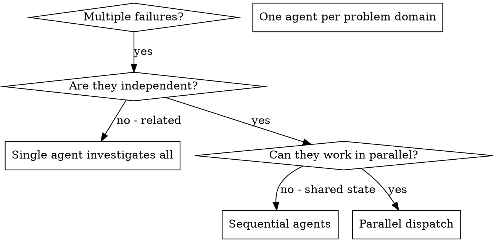

# Dispatching Parallel Agents

## Overview

You delegate tasks to specialized agents with isolated context. Craft their instructions and context precisely, so that they stay focused and succeed at their task. They must never inherit your session's context or history. You construct exactly what they need. This also preserves your own context for coordination work.

When you have multiple unrelated failures (different test files, different subsystems, different bugs), investigating them sequentially wastes time. Each investigation is independent and can happen in parallel.

**Core principle:** Dispatch one agent per independent problem domain. Let them work concurrently.

See the [Tau `task` tool reference](../using-superpowers/references/tau-tools.md) for the complete argument, scope, approval, isolation, and result contract.

## When to Use



**Use when:**
- 3+ test files failing with different root causes
- Multiple subsystems broken independently
- You can understand each problem without context from the others
- No shared state between investigations

**Do not use when:**
- Failures are related (fixing one can fix the others)
- Need to understand the full system state
- Agents can interfere with each other

## The Pattern

### 1. Identify Independent Domains

Group failures by what is broken:
- File A tests: Tool approval flow
- File B tests: Batch completion behavior
- File C tests: Abort functionality

Each domain is independent - fixing tool approval does not affect abort tests.

### 2. Create Focused Agent Tasks

Each agent gets:
- **Specific scope:** One test file or subsystem
- **Clear goal:** Make these tests pass
- **Constraints:** Do not change other code
- **Expected output:** Summary of what you found and fixed

### 3. Dispatch in Parallel

Call the Tau `task` tool with one `tasks` argument object. The same `tasks` shape with a single item dispatches one child. Two or more items run at most four children concurrently and preserve input order in the result:

```json
{
  "tasks": [
    {
      "agent": "general-purpose",
      "task": "Fix agent-tool-abort.test.ts failures. Stay within this test domain and return a summary of the root cause, files changed, and tests run."
    },
    {
      "agent": "general-purpose",
      "task": "Fix batch-completion-behavior.test.ts failures. Stay within this test domain and return a summary of the root cause, files changed, and tests run."
    },
    {
      "agent": "general-purpose",
      "task": "Fix tool-approval-race-conditions.test.ts failures. Stay within this test domain and return a summary of the root cause, files changed, and tests run."
    }
  ]
}
```

### 4. Review and Integrate

When agents return:
- Read each input-ordered summary and inspect `details.results` for status or process failures
- Resolve `DONE_WITH_CONCERNS`, `BLOCKED`, and `NEEDS_CONTEXT` explicitly. If an agent needs more context, re-dispatch it with a complete prompt
- Check that fixes do not conflict
- Run the full test suite
- Integrate all changes

## Agent Prompt Structure

Good agent prompts are:
1. **Focused** - One clear problem domain
2. **Self-contained** - All context needed to understand the problem
3. **Specific about output** - What the agent must return

```markdown
Fix the 3 failing tests in src/agents/agent-tool-abort.test.ts:

1. "should abort tool with partial output capture" - expects 'interrupted at' in message
2. "should handle mixed completed and aborted tools" - fast tool aborted instead of completed
3. "should properly track pendingToolCount" - expects 3 results but gets 0

These are timing/race condition issues. Your task:

1. Read the test file and understand what each test verifies
2. Identify root cause - timing issues or actual bugs?
3. Fix by:
   - Replacing arbitrary timeouts with event-based waiting
   - Fixing bugs in abort implementation if found
   - Adjusting test expectations if testing changed behavior

Do NOT just increase timeouts - find the real issue.

Return: Summary of what you found and what you fixed.
```

## Common Mistakes

**❌ Too broad:** "Fix all the tests" - agent gets lost
**✅ Specific:** "Fix agent-tool-abort.test.ts" - focused scope

**❌ No context:** "Fix the race condition" - the agent does not know where
**✅ Context:** Paste the error messages and test names

**❌ No constraints:** The agent can refactor everything
**✅ Constraints:** "Do NOT change production code" or "Fix tests only"

**❌ Vague output:** "Fix it" - you do not know what changed
**✅ Specific:** "Return summary of root cause and changes"

## When NOT to Use

**Simple operations:** Reading files, running commands, or making small edits.
These are tool calls, not agent tasks. Use them directly. The overhead of
dispatching a subagent (context construction, dispatch, result parsing) far
exceeds the cost of a single `read`, `bash`, or `edit` call.

**Tasks completable in 1-2 tool calls:** If the work is a single read, a single
edit, or a simple command, do it yourself. Subagents are for substantive work.

**Related failures:** Fixing one can fix the others - investigate them together first
**Need full context:** Understanding requires seeing the entire system
**Exploratory debugging:** You do not know what is broken yet
**Shared state:** Agents can interfere (editing the same files, using the same resources)

## Real Example from Session

**Scenario:** 6 test failures across 3 files after major refactoring

**Failures:**
- agent-tool-abort.test.ts: 3 failures (timing issues)
- batch-completion-behavior.test.ts: 2 failures (tools not executing)
- tool-approval-race-conditions.test.ts: 1 failure (execution count = 0)

**Decision:** Independent domains - abort logic separate from batch completion separate from race conditions

**Dispatch:**
```
Agent 1 → Fix agent-tool-abort.test.ts
Agent 2 → Fix batch-completion-behavior.test.ts
Agent 3 → Fix tool-approval-race-conditions.test.ts
```

**Results:**
- Agent 1: Replaced timeouts with event-based waiting
- Agent 2: Fixed event structure bug (threadId in wrong place)
- Agent 3: Added wait for async tool execution to complete

**Integration:** All fixes independent, no conflicts, full suite green

**Time saved:** 3 problems solved in parallel vs sequentially

## Key Benefits

1. **Parallelization** - Multiple investigations happen simultaneously
2. **Focus** - Each agent has narrow scope, less context to track
3. **Independence** - Agents do not interfere with each other
4. **Speed** - 3 problems solved in time of 1

## Verification

After agents return:
1. **Review each summary** - Understand what changed
2. **Check for conflicts** - Did agents edit the same code?
3. **Run the full suite** - Check that all fixes work together
4. **Spot check** - Agents can make systematic errors
