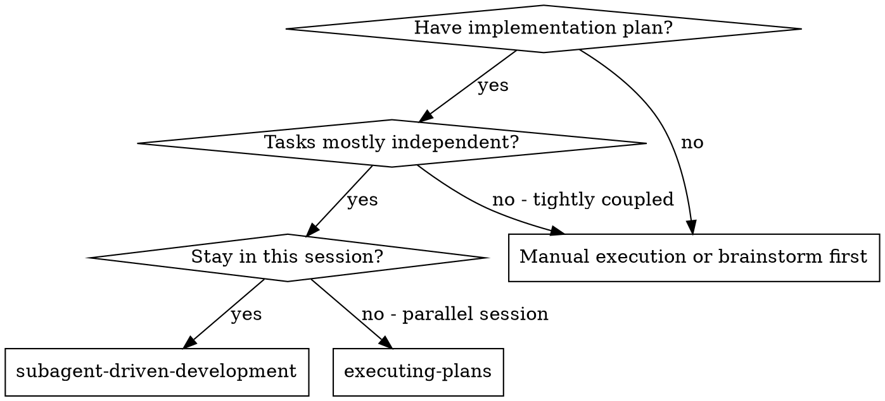
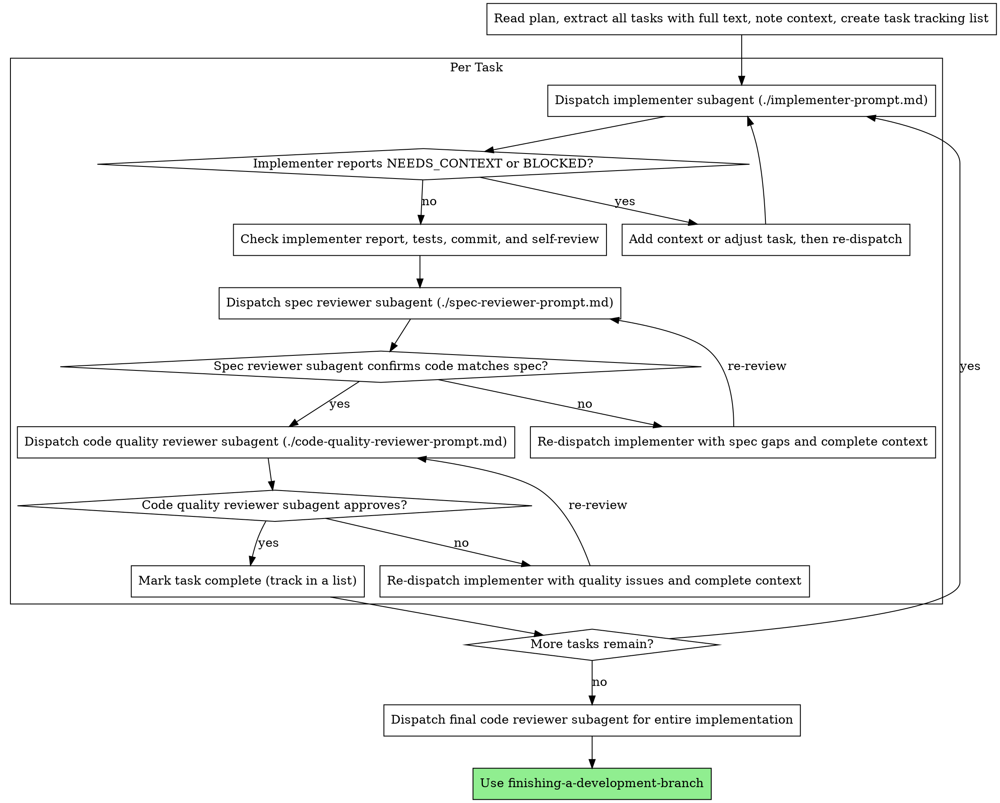

# Subagent-Driven Development

Execute plan by dispatching fresh subagent per task, with two-stage review after each: spec compliance review first, then code quality review.

**Why subagents:** You delegate tasks to specialized agents with isolated context. By precisely crafting their instructions and context, you ensure they stay focused and succeed at their task. They do not inherit your session's context or history — you construct exactly what they need. A Tau child cannot converse with the controller mid-task; it reports `NEEDS_CONTEXT` or `BLOCKED`, and the controller re-dispatches with a new complete prompt. This also preserves your own context for coordination work.

**Core principle:** Fresh subagent per task + two-stage review (spec then quality) = high quality, fast iteration

## When to Use



**vs. Executing Plans (parallel session):**
- Same session (no context switch)
- Fresh subagent per task (no context pollution)
- Two-stage review after each task: spec compliance first, then code quality
- Faster iteration (no human-in-loop between tasks)

**vs. Doing it yourself:**
- Only use sub-agents when tasks are substantive (3+ tool calls minimum per task)
- For simple plans (1-2 trivial tasks), execute directly — sub-agent overhead
  (context construction + dispatch + review cycle) far exceeds the work itself
- Reading files, making small edits, running commands — do these yourself

## The Process



## Provider and Model Selection

The bundled agents pin their model and reasoning effort, so omit `provider`, `model`, and `reasoningEffort` by default:

- **`implementation`** — runs `openrouter:deepseek/deepseek-v4-flash-0731` at `high` reasoning effort.
- **`code-review`** — runs `openrouter:deepseek/deepseek-v4-flash-0731` at `xhigh` reasoning effort. It returns a strict `## Code Review` section followed by a `## Summary`; the `task` result relays both to you.
- `general-purpose` and `read-only` — inherit the parent session's active provider/model; use them when a child must not be pinned (scouting, document inspection).

Do not set overrides merely to optimize cost or speed. If the user explicitly requests or approves an override, pass `provider`, `model`, and optionally `reasoningEffort` as separate opaque `task` fields; never infer one from the other or split a slash-containing model identifier.

Match capability to role: implementation stays on its pinned model at `high` reasoning effort, while review work uses the review-profile agents at `xhigh`.

## Handling Implementer Status

Implementer subagents report one of four semantic statuses in the `task` result. Inspect both summary content and `details.results`; process failure, timeout, or cancellation is separate from semantic status. Handle each appropriately:

**DONE:** Proceed to spec compliance review.

**DONE_WITH_CONCERNS:** The implementer completed the work but flagged doubts. Read the concerns before proceeding. If the concerns are about correctness or scope, address them before review. If they're observations (e.g., "this file is getting large"), note them and proceed to review.

**NEEDS_CONTEXT:** The implementer needs information that wasn't provided. Provide the missing context and re-dispatch.

**BLOCKED:** The implementer cannot complete the task. Assess the blocker:
1. If it's a context problem, provide more context and re-dispatch on the implementation agent
2. If the task is too large, break it into smaller pieces
3. If the plan itself is wrong, escalate to the human

**Never** ignore an escalation or force the same model to retry without changes. If the implementer said it's stuck, something needs to change.

## Prompt Templates

- `./implementer-prompt.md` - Dispatch implementer subagent
- `./spec-reviewer-prompt.md` - Dispatch spec compliance reviewer subagent
- `./code-quality-reviewer-prompt.md` - Dispatch code quality reviewer subagent

All templates use the Tau `task` argument schema documented in [`../using-superpowers/references/tau-tools.md`](../using-superpowers/references/tau-tools.md). Reviewer prompts should still include every readable file path plus any required diff, search, or command output; reviewers can additionally verify with read-only `bash` (git diff/log/status, grep/rg/find) but must never change the state of the repository.

## Spec Compliance Review References

The spec compliance reviewer uses **three references** to verify the implementation:

| Reference | Role | Question it answers |
|-----------|------|---------------------|
| **Delta spec** (primary) | Behavioral contract | "Is every ADDED requirement implemented? Is everything MODIFIED reflected? Is everything REMOVED gone? Is there nothing extra beyond the delta?" |
| **Feature spec + proposal** (context) | Intent and rationale | "Are internal changes (refactoring, architecture) consistent with the design intent?" |
| **Task text** (execution) | What was asked this task | "Did the implementer follow the steps they were given?" |

**Before dispatching the spec reviewer,** read the delta spec from `docs/design/<date>-<topic>-delta.md` and include its FULL TEXT in the reviewer's context alongside the task requirements. This is REQUIRED — not optional. The spec reviewer cannot verify behavioral compliance without the delta spec.

**Delta spec mutability:** During the review loop, if the spec compliance reviewer finds a discrepancy between the code and the delta spec, you must decide whether to:
- (a) **Fix the code** — the delta spec is correct, the implementation is wrong
- (b) **Update the delta spec** — the implementation is correct, the delta was incomplete or wrong

If you update the delta spec, re-check that every ADDED/MODIFIED requirement still has a corresponding task with a test, then re-dispatch the spec reviewer. The delta spec is a living document during implementation, not frozen after writing-plans.

**Per-task scope note:** A single delta requirement may span multiple plan tasks. The per-task reviewer checks "did this task implement what was asked" not "is the full delta requirement satisfied." Full delta compliance is verified after all tasks complete (final code review).

## Example Workflow

```
You: I'm using Subagent-Driven Development to execute this plan.

[Read plan file once: docs/plans/feature-plan.md]
[Extract all 5 tasks with full text and context]
[Create task tracking list]

Task 1: Hook installation script

[Get Task 1 text and context (already extracted)]
[Dispatch task with agent: 'implementation' and the implementer prompt as the task]

Implementer: `NEEDS_CONTEXT` — "Should the hook be installed at user or system level?"

You: "User level (`~/.config/example-tool/hooks/`)"

[Re-dispatch the implementer with that answer included in the complete task prompt.]
Implementer: "Got it. Implementing now..."
[Later] Implementer:
  - Implemented install-hook command
  - Added tests, 5/5 passing
  - Self-review: Found I missed --force flag, added it
  - Committed

[Dispatch task with agent: 'code-review' and the spec reviewer prompt as the task]
Spec reviewer: `## Code Review` section with verdict + points, then `## Summary` — spec compliant, nothing extra

[Get git SHAs, dispatch task with agent: 'code-review' and the code quality reviewer prompt as the task]
Code reviewer: `## Code Review` section: no Critical/Important issues, Approved; `## Summary`.

[Mark Task 1 complete in task tracking list]

Task 2: Recovery modes

[Get Task 2 text and context (already extracted)]
[Dispatch task with agent: 'implementation' and the implementer prompt as the task]

Implementer: [Returns `DONE` with its implementation report]
Implementer:
  - Added verify/repair modes
  - 8/8 tests passing
  - Self-review: All good
  - Committed

[Dispatch task with agent: 'code-review' and the spec reviewer prompt as the task]
Spec reviewer: `## Code Review` issues:
  - Missing: Progress reporting (spec says "report every 100 items")
  - Extra: Added --json flag (not requested)

[Re-dispatch implementer with the original task, full context, and review findings]
Implementer: Removed --json flag, added progress reporting

[Spec reviewer reviews again — dispatch task with agent: 'code-review' again]
Spec reviewer: `## Code Review` verdict: compliant — nothing extra

[Dispatch task with agent: 'code-review' and the code quality reviewer prompt as the task]
Code reviewer: `## Code Review` section: Important issue (magic number 100); `## Summary`

[Re-dispatch implementer with the original task, full context, and review findings]
Implementer: Extracted PROGRESS_INTERVAL constant

[Code reviewer reviews again — dispatch task with agent: 'code-review' again]
Code reviewer: `## Code Review` verdict: Approved

[Mark Task 2 complete in task tracking list]

...

[After all tasks]
[Dispatch task with agent: 'code-review' for final code review]
Final reviewer: All requirements met, ready to merge

Done!
```

## Advantages

**vs. Manual execution:**
- Subagents follow TDD naturally
- Fresh context per task (no confusion)
- Sequential implementation dispatches avoid agents editing the same task at once
- Missing context is surfaced explicitly through `NEEDS_CONTEXT` for a complete re-dispatch

**vs. Executing Plans:**
- Same session (no handoff)
- Continuous progress (no waiting)
- Review checkpoints automatic

**Efficiency gains:**
- No file reading overhead (controller provides full text)
- Controller curates exactly what context is needed
- Subagent gets complete information upfront
- Missing assumptions surface as `NEEDS_CONTEXT` instead of silent guesses

**Quality gates:**
- Self-review catches issues before handoff
- Two-stage review: spec compliance, then code quality
- Review loops ensure fixes actually work
- Spec compliance prevents over/under-building
- Code quality ensures implementation is well-built

**Cost:**
- More subagent invocations (implementer + 2 reviewers per task)
- Controller does more prep work (extracting all tasks upfront)
- Review loops add iterations
- But catches issues early (cheaper than debugging later)

## Red Flags

**Never:**
- Start implementation on main/master branch without explicit user consent
- Skip reviews (spec compliance OR code quality)
- Proceed with unfixed issues
- Dispatch multiple implementation subagents in parallel (conflicts)
- Make subagent read plan file (provide full text instead)
- Skip scene-setting context (subagent needs to understand where task fits)
- Ignore a `NEEDS_CONTEXT` report instead of supplying the requested information
- Accept "close enough" on spec compliance (spec reviewer found issues = not done)
- Skip review loops (reviewer found issues = implementer fixes = review again)
- Let implementer self-review replace actual review (both are needed)
- **Start code quality review before spec compliance is ✅** (wrong order)
- Move to next task while either review has open issues

**If a subagent reports `NEEDS_CONTEXT`:**
- Answer clearly and completely
- Add the missing information to a new self-contained task prompt
- Re-dispatch; there is no mid-task conversation or resumed child context

**If reviewer finds issues:**
- Re-dispatch an implementer with the original task, current state, and specific findings
- Re-dispatch the reviewer with the complete updated review input
- Repeat until approved
- Don't skip the re-review

**If subagent fails task:**
- Dispatch fix subagent with specific instructions
- Don't try to fix manually (context pollution)

## Integration

**Required workflow skills:**
- **using-git-worktrees** - REQUIRED: Set up isolated workspace before starting
- **writing-plans** - Creates the plan this skill executes
- **requesting-code-review** - Code review template for reviewer subagents
- **finishing-a-development-branch** - Complete development after all tasks

**Implementer prompts should embed:**
- The required **test-driven-development** steps and discipline. Tau children are instructed not to invoke ambient user skills, so naming a skill is not a substitute for including its required behavior in the delegated prompt.
- The **code standards** from the implementer prompt (DRY, low cyclomatic complexity, type safety, no unnecessary abstractions/fallbacks/hacks, informative docstrings, current-state-only documentation). They are enforced by the adversarial reviewers, so implementers must be told them up front.

**Alternative workflow:**
- **executing-plans** - Use for parallel session instead of same-session execution
