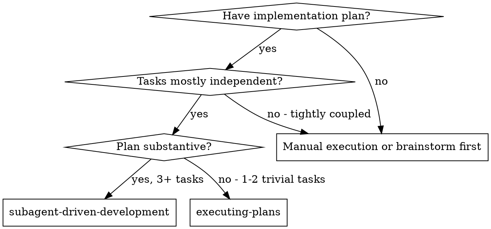
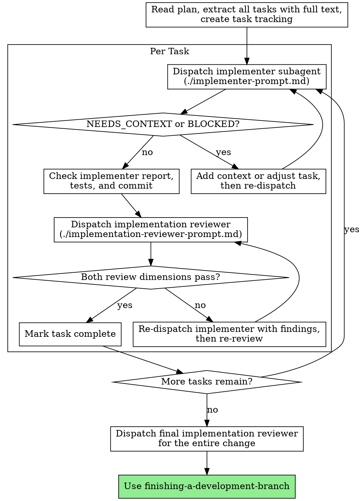

# Subagent-Driven Development

Execute the plan by dispatching a fresh implementer subagent per task, then a single review subagent per task that checks spec compliance and code quality in one pass.

**Announce at start:** "I'm using subagent-driven-development to execute this plan."

**Operating rules:**

- Children do not inherit this conversation. Every dispatch must be self-contained: full task text, file paths, context, expected report format
- There is no mid-task conversation. A child reports DONE, DONE_WITH_CONCERNS, BLOCKED, or NEEDS_CONTEXT; you re-dispatch with a new complete prompt
- Dispatch with the `task` tool: the `implementation` agent for implementers, the `code-review` agent for reviewers. Omit `provider`, `model`, and `reasoningEffort` unless the user requests an override
- Call schema and result contract: [`../using-superpowers/references/tau-tools.md`](../using-superpowers/references/tau-tools.md)

## When to Use



## The Process



1. Read the plan once. Extract every task with its full text. Create task tracking.
2. Per task:
   a. Dispatch the implementer (`./implementer-prompt.md`)
   b. Handle the reported status (below)
   c. Check the implementer's report: tests ran and pass, work committed, self-review done
   d. Dispatch the implementation reviewer (`./implementation-reviewer-prompt.md`) with the full feature-spec text, the task text, the implementer's report, every relevant file path, the diff, and the verification output
   e. The reviewer reports on two dimensions — **Spec Compliance** and **Code Quality**. If either has findings: re-dispatch the implementer with the original task, current state, and the findings; then re-dispatch the reviewer with updated evidence. Repeat until both pass
   f. Mark the task complete
3. After the last task: dispatch the implementation reviewer over the entire change. The final review verifies the FULL feature spec (per-task reviews only check their own task)
4. Invoke finishing-a-development-branch

## Handling Implementer Status

**DONE:** Proceed to review.

**DONE_WITH_CONCERNS:** Read the concerns. If they affect correctness or scope, resolve them before review. If they are observations, note them and proceed.

**NEEDS_CONTEXT:** Supply the missing information in a new complete prompt and re-dispatch.

**BLOCKED:** Assess the blocker: add context and re-dispatch; split an oversized task; or escalate to the user if the plan itself is wrong.

Never re-dispatch a stuck implementer with no changes — a plain restart is not a fix.

## Review Inputs

| Input | Role |
|-------|------|
| **Feature spec** (full text, REQUIRED) | The behavioral contract: is every relevant ADDED requirement present, every MODIFIED reflected, every REMOVED gone, and nothing extra built |
| **Proposal** (relevant sections) | Design intent for internal changes (refactoring, architecture) |
| **Task text** | What this task was asked to do |
| **Implementer report + file paths + diff + verification output** | Evidence |

**Per-task scope:** a single spec requirement may span several tasks. The per-task reviewer checks "did this task implement what was asked", not "is the full requirement satisfied". Full-spec compliance is verified by the final review.

**Spec discrepancies:** if the reviewer reports a mismatch between code and feature spec, decide:

- (a) Fix the code — the spec is correct, the implementation is wrong
- (b) Update the feature spec — the implementation is correct, the spec was incomplete or wrong. After a spec update, re-check that every requirement still has a task with tests, then re-review

## Example Task Cycle

```
[Dispatch task with agent: 'implementation' and the filled implementer prompt]
Implementer: DONE — implemented X, 5/5 tests passing, committed

[Dispatch task with agent: 'code-review' and the filled implementation reviewer prompt]
Reviewer:
  ## Code Review
  Verdict: Needs fixes
  ### Spec Compliance — ❌ missing progress reporting (spec requires it)
  ### Code Quality — Important: magic number at reporter.py:42
  **Status: DONE_WITH_CONCERNS**

[Re-dispatch implementer with the original task, current state, and findings]
Implementer: DONE — added progress reporting, extracted PROGRESS_INTERVAL

[Re-dispatch reviewer with updated diff]
Reviewer: Verdict Approved; both dimensions clean

[Mark task complete]
```

## Red Flags

**Never:**
- Implement on the default branch — work happens on the branch/worktree created during brainstorming
- Dispatch implementers in parallel (they share the working tree)
- Make a subagent read the plan file — provide the full task text instead
- Skip the per-task review or the final review
- Proceed while either review dimension has open findings
- Start the next task before both dimensions pass
- Re-dispatch a stuck implementer unchanged
- Fix a failed task yourself — dispatch a fix subagent with specific instructions
- Accept "close enough" on spec compliance

## Integration

- **using-git-worktrees** — the workspace, created during brainstorming
- **writing-plans** — creates the plan this skill executes
- **test-driven-development** — its discipline is embedded in the implementer prompt; children cannot invoke skills, so prompts carry the required behavior
- **requesting-code-review** — ad-hoc reviews outside the plan workflow
- **finishing-a-development-branch** — after the final review passes
