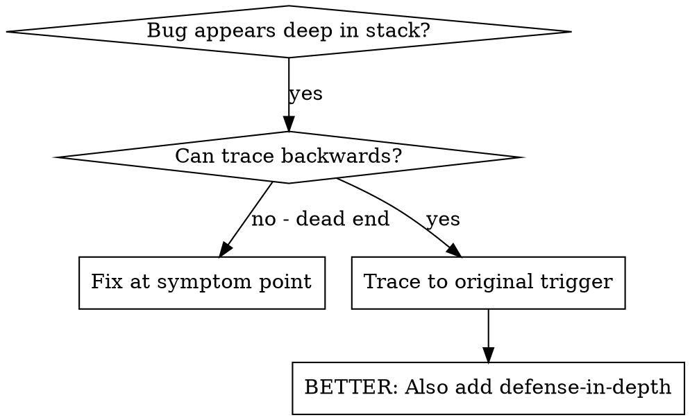
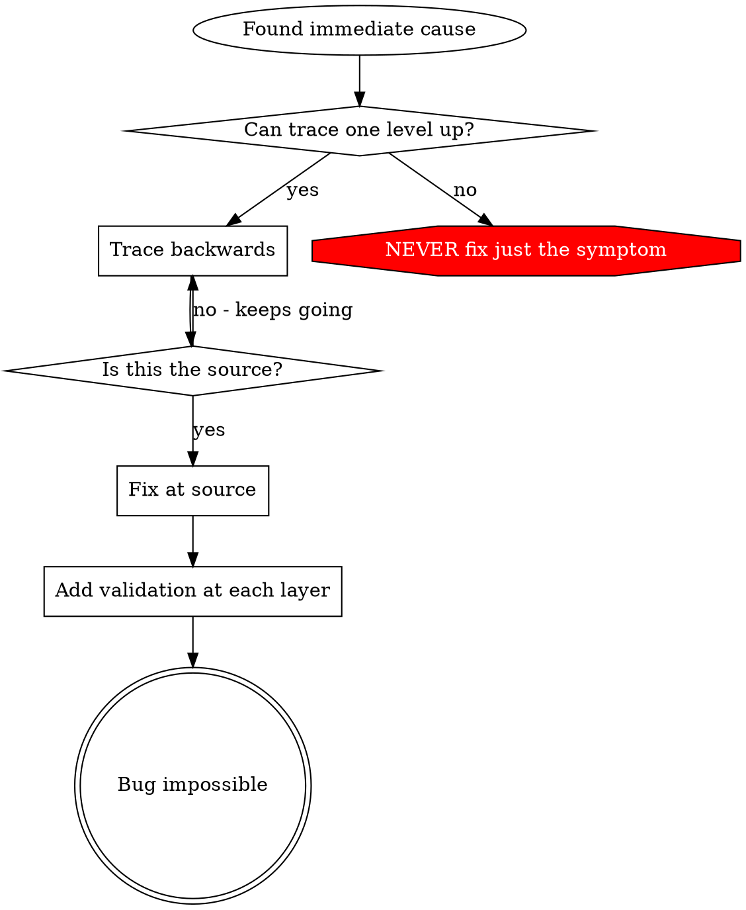

# Root Cause Tracing

## Overview

Bugs often manifest deep in the call stack (git init in the wrong directory, a file created in the wrong location, a database opened with the wrong path). Your instinct is to fix where the error appears. That treats a symptom.

**Core principle:** Trace backward through the call chain until you find the original trigger. Then fix at the source.

## When to Use



**Use when:**
- The error happens deep in execution (not at the entry point)
- The stack trace shows a long call chain
- It is unclear where the invalid data originated
- You need to find which test or code triggers the problem

## The Tracing Process

### 1. Observe the Symptom
```
Error: git init failed in /Users/jesse/project/packages/core
```

### 2. Find Immediate Cause
**What code directly causes this?**
```typescript
await execFileAsync('git', ['init'], { cwd: projectDir });
```

### 3. Ask: What Called This?
```typescript
WorktreeManager.createSessionWorktree(projectDir, sessionId)
  → called by Session.initializeWorkspace()
  → called by Session.create()
  → called by test at Project.create()
```

### 4. Keep Tracing Up
**What value did the caller pass?**
- `projectDir = ''` (empty string!)
- An empty string as `cwd` resolves to `process.cwd()`
- That is the source code directory!

### 5. Find Original Trigger
**Where did the empty string come from?**
```typescript
const context = setupCoreTest(); // Returns { tempDir: '' }
Project.create('name', context.tempDir); // Accessed before beforeEach!
```

## Adding Stack Traces

When you cannot trace manually, add instrumentation:

```typescript
// Before the problematic operation
async function gitInit(directory: string) {
  const stack = new Error().stack;
  console.error('DEBUG git init:', {
    directory,
    cwd: process.cwd(),
    nodeEnv: process.env.NODE_ENV,
    stack,
  });

  await execFileAsync('git', ['init'], { cwd: directory });
}
```

**Critical:** Use `console.error()` in tests, not the logger. The logger can hide the output.

**Run and capture:**
```bash
npm test 2>&1 | grep 'DEBUG git init'
```

**Analyze stack traces:**
- Look for test file names
- Find the line number that triggers the call
- Identify the pattern (same test? same parameter?)

## Finding Which Test Causes Pollution

If something appears during tests but you do not know which test:

Use the bisection script `find-polluter.sh` in this directory:

```bash
./find-polluter.sh '.git' 'src/**/*.test.ts'
```

The script runs the tests one by one and stops at the first polluter. See the script for usage.

## Real Example: Empty projectDir

**Symptom:** `.git` created in `packages/core/` (source code)

**Trace chain:**
1. `git init` runs in `process.cwd()` ← empty cwd parameter
2. WorktreeManager receives an empty projectDir
3. Session.create() passes the empty string
4. The test accesses `context.tempDir` before beforeEach runs
5. setupCoreTest() returns `{ tempDir: '' }` initially

**Root cause:** A top-level variable initialization accesses an empty value

**Fix:** tempDir is now a getter that throws if a test accesses it before beforeEach

**Also added defense-in-depth:**
- Layer 1: Project.create() validates the directory
- Layer 2: WorkspaceManager validates not empty
- Layer 3: NODE_ENV guard refuses git init outside tmpdir
- Layer 4: Stack trace logging before git init

## Key Principle



**NEVER fix only where the error appears.** Trace back to find the original trigger.

## Stack Trace Tips

**In tests:** Use `console.error()`, not the logger. The logger can hide the output.
**Before operation:** Log before the dangerous operation, not after it fails
**Include context:** Directory, cwd, environment variables, timestamps
**Capture stack:** `new Error().stack` shows the complete call chain

## Real-World Impact

From a debugging session (2025-10-03):
- Found the root cause through a 5-level trace
- Fixed at the source (getter validation)
- Added 4 layers of defense
- 1847 tests passed, zero pollution
