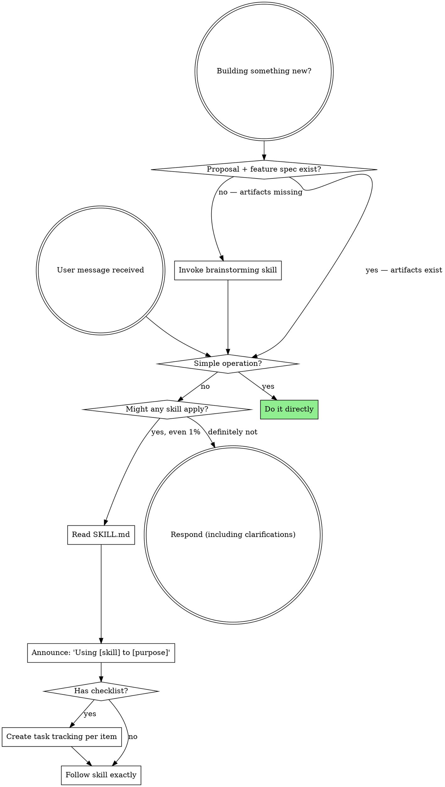

**Subagents:** If you were dispatched as a subagent to execute a specific task, skip this skill.

If a skill might apply to what you are doing — even at 1% probability — read its `SKILL.md` before acting and follow it. If it turns out not to apply, discard it and proceed.

## Simple Operations — No Skill Needed

Do NOT invoke skills or dispatch subagents for operations that are trivially fast and carry no risk of errors:

- Reading 1-3 files to understand code, configuration, or output
- Making a single edit to a file
- Running a simple command (ls, grep, find, git status, etc.)
- Answering a question based on information you already have
- Searching the codebase for a string or pattern
- Inspecting test output or error logs

These are tool calls, not tasks. Dispatch subagents only for work that is:

- **Multi-step:** 3+ distinct actions with judgment between them
- **Substantive:** implementation, debugging, or design decisions
- **Risk-bearing:** could introduce bugs if done incorrectly
- **Time-consuming:** more than a handful of tool calls

## Instruction Priority

1. **User's explicit instructions** (AGENTS.md, direct requests) — highest priority
2. **Superpowers skills** — override default system behavior where they conflict
3. **Default system prompt** — lowest priority

## How Skills Work

Tau initially places only each skill's name, description, and path in the system prompt. When a skill applies, read its `SKILL.md` before acting and follow its instructions. Users can invoke one explicitly with `/skill:<name>`. Resolve supporting files relative to the skill directory.

Subagent dispatch is handled by the `task` tool (see [`references/tau-tools.md`](references/tau-tools.md)). A child does not inherit this conversation, so every delegated task must be self-contained.

## The Flow

Invoke relevant or requested skills BEFORE any response or action. Announce each one: "Using [skill] to [purpose]".

## Skill Priority

When multiple skills could apply:

1. **Process skills first** (brainstorming, systematic-debugging) — they determine HOW to approach the task
2. **Implementation skills second** (domain-specific) — they guide execution

"Let's build X" → brainstorming first, then implementation skills.
"Fix this bug" → systematic-debugging first, then domain-specific skills.

**What counts as "already brainstormed":** brainstorming is complete when the proposal (`docs/design/YYYY-MM-DD-<topic>-proposal.md`) and the feature spec (`docs/design/YYYY-MM-DD-<topic>-spec.md`) both exist. A conversation about the idea is not brainstorming. If the artifacts don't exist, invoke brainstorming — even if you've already discussed the idea at length.
